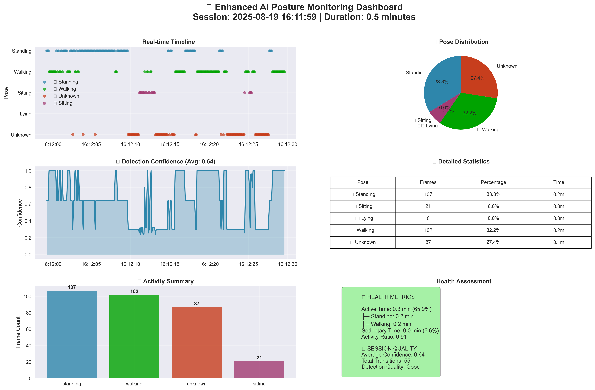
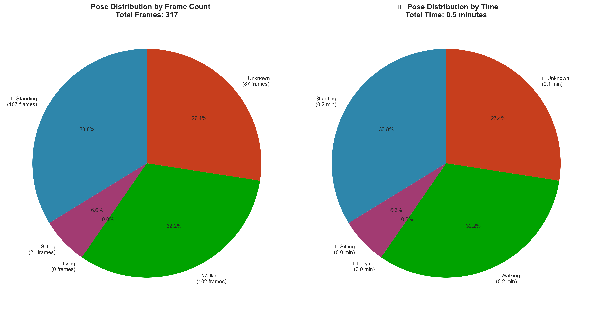
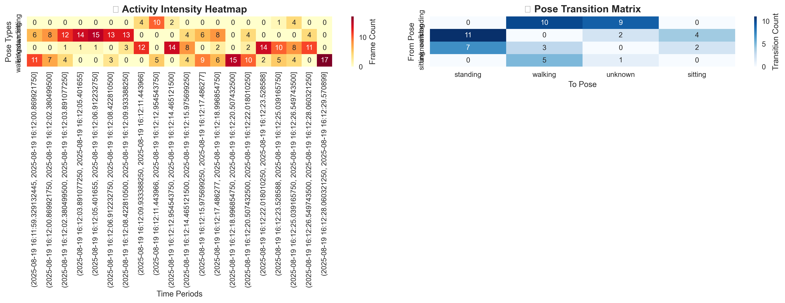

# ai_posture_monitor: Real-Time AI-Powered Posture Monitoring

This project, `ai_posture_monitor`, is designed to be an innovative and cost-effective solution for real-time activity monitoring of elderly individuals. It utilizes the MediaPipe pose estimation model, along with fuzzy logic and finite state machines, to achieve reliable tracking, posture recognition, and fall detection.

## Contents
- Key Functionalities
- How it Works
- Other Utility Scripts
- Color Codes
- Evaluation
- Dataset
- Self-Consent Form for Dataset Usage


## Key Functionalities

* **Real-time Activity Monitoring:** Continuously tracks and analyzes movements, providing a comprehensive view of activity patterns.
* **Pose Detection:** Accurately identifies key postures such as standing, sitting, lying down, and walking.
* **Fall Detection:** Detects sudden falls through rapid vertical movement analysis and transition to lying position, providing critical safety alerts.
* **Walking Detection:** Recognizes walking patterns through frame-to-frame movement analysis of key joints.
* **Fuzzy Logic Analysis:** Employs fuzzy logic for accurate interpretation of movement data, enhancing the system's reliability.
* **User-Centric Design:** Specifically designed for the needs of elderly individuals living alone, providing a user-friendly experience.
* **Environmental Adaptability:** Functions effectively in well-lit indoor settings, suitable for typical home environments.
* **Scalable and Cost-Effective:** Represents an affordable solution with potential for diverse applications in elderly care.

## How it Works
1. Install the package  
   `pip install ai-posture-monitor`  

2. Predict Static Posture on your video file
```
import ai_posture_monitor as pm

pe = pm.PoseEstimation()
pe.process_video(video_file=video_file, plot_results=True, predict_fall=False)
```

3. Fall Detection on your video file
```
import ai_posture_monitor as pm

pe = pm.PoseEstimation()
pe.process_video(video_file=video_file, plot_results=True)
```

----

## Using Source Codes in Repo
Alternatively, you can use the project source code to run a complete workflow from validating your labels to predictions and outputting your results  

Install the dependencies:
```aiignore
pip install numpy
pip install opencv-python
pip install mediapipe
pip install pandas
pip install scikit-learn
pip install matplotlib
```
Pre-requisite: this prototype is built to be executed from the command line only

### Definition of Fall
When the subject remains in the fallen state for at least 1 second excluding transition to the fallen state

### How to Prepare New Dataset
1. Extract keyframes from the video at a rate of one frame per second to represent the temporal evolution of the activity
```aiignore
python proof-of-concept/pose-estimation-on-video/groundtruth.py ./dataset/fall_detection_4.mp4
```
2. Create a label csv file by recording the activities for each second, shown below is an example csv file
```aiignore
start_time,end_time,action,is_fall
0,10,None,False
11,32,Stand,False
33,41,Stand,False
42,91,Stand,False
92,93,Stand,False
94,95,Stand-Lie,True
96,98,Lie,True
99,100,Lie-Stand,False
101,111,Stand,False
112,112,Stand-Sit,False
113,115,Sit,False
116,116,Sit-Lie,False
116,116,Sit-Lie,False
```
3. Visually validate the labelled data by verifying that the plot follows a logical pattern
```aiignore
python proof-of-concept/pose-estimation-on-video/analyze_manual_label.py ./labels/fall_detection_4.csv 0
```
**Note:** the second argument can accept values of 1 or 0  
-- 1: Show all classes in the plot  
-- 0: Compress to only key classes (Stand, Sit, Lie)  
  
This plot will give you an idea of the class balance  

4. Fall Detection
Use the video and labels to detect and validate falls  
`python proof-of-concept/pose-estimation-on-video/predict_fall.py VIDEO_FILE MAKE_PREDICTION SCALING_FACTOR LABEL_CSV_FILE`  
**Note:**  
-- VIDEO_FILE: file path to the video file  
-- MAKE_PREDICTION: accepts 1 or 0   
-- SCALING_FACTOR: accepts >= 0.1   
-- LABEL_CSV_FILE: file path to the csv label file   

You can also perform posture classification only with  
`python proof-of-concept/pose-estimation-on-video/predict_pose.py VIDEO_FILE MAKE_PREDICTION SCALING_FACTOR LABEL_CSV_FILE`  

Example:
```aiignore
python proof-of-concept/pose-estimation-on-video/predict_fall.py ./dataset/fall_detection_9.mp4 1 1 ./labels/fall_detection_9.csv
python proof-of-concept/pose-estimation-on-video/predict_pose.py ./dataset/fall_detection_9.mp4 1 1 ./labels/fall_detection_9.csv
```

5. Visualize Fall Plot
```aiignore
python proof-of-concept/pose-estimation-on-video/fall_plot.py ./output/output_results/fall_detection_4_results.csv
```

---

## Other Utility Scripts
Plot Histogram
```aiignore
python proof-of-concept/pose-estimation-on-video/plot_his.py ./dataset/hr_fall_detection_3.mp4 1
```

Frame Differencing
```aiignore
python proof-of-concept/pose-estimation-on-video/frame_diff.py ./dataset/hr_fall_detection_3.mp4 1
```

Predict Pose
```aiignore
python proof-of-concept/pose-estimation-on-video/predict_pose.py ./dataset/hr_fall_detection_3.mp4 1 1
python proof-of-concept/pose-estimation-on-video/predict_pose.py ./dataset/hr_fall_detection_3.mp4 1 1 ./labels/hr_fall_detection_3.csv
```

Get Ground Truth
```aiignore
python proof-of-concept/pose-estimation-on-video/groundtruth.py ./dataset/hr_fall_detection_1.mp4
python proof-of-concept/pose-estimation-on-video/groundtruth.py ./dataset/hr_fall_detection_2.mp4
python proof-of-concept/pose-estimation-on-video/groundtruth.py ./dataset/hr_fall_detection_3.mp4

python proof-of-concept/pose-estimation-on-video/groundtruth.py ./dataset/fall_detection_4.mp4
```

Analyze Ground Truth
```aiignore
python proof-of-concept/pose-estimation-on-video/analyze_manual_label.py ./labels/hr_fall_detection_3.csv 1
python proof-of-concept/pose-estimation-on-video/analyze_manual_label.py ./labels/fall_detection_4.csv 1

python proof-of-concept/pose-estimation-on-video/analyze_manual_label.py ./output/output_results/hr_fall_detection_3_results.csv 1 prediction
```

# Color Codes
Yellow: bounding box of the expanded area of interest from memory  
Blue: the bounding box by expanding the current area of interest to include the previous area of interest, creating a union of both if they intersect  
Green: bounding box around the moving object  
Pink: bounding box around the detected pose  
  
Evaluate Static Pose Prediction  
```aiignore
python proof-of-concept/pose-estimation-on-video/static_pose_eval.py ./output/output_results/_results.csv
```

Track and Plot Velocity of Keypoints
```aiignore
python proof-of-concept/pose-estimation-on-video/plot_activity_prediction.py ./output/output_results/hr_fall_detection_1_results.csv
```

Plot Activity Recognition
```aiignore
python proof-of-concept/pose-estimation-on-video/transition_plot.py ./output/output_results/hr_fall_detection_3_results.csv
```


## Dataset: Video Files used in this Experiment
Dataset in University of Essex Onedrive: https://essexuniversity-my.sharepoint.com/:f:/g/personal/po23102_essex_ac_uk/End63nA718NNjDdOPOjRaMABtli7MI-JnkAZwXesGFe2KA?e=Bmxtjf


# Self-Consent Form for Dataset Usage

**Project Title:** AI-Driven Posture Analysis Fall Detection System for the Elderly

**Researcher Name:** Patrick O. Ogbuitepu

**Purpose of the Dataset:**

This dataset, consisting of 113 static images and 9 video recordings, will be used solely for academic research and development of an AI-powered fall detection system for the elderly as part of my dissertation project.

**Dataset Details:**

* **Static Images:** 113 self-portraits capturing various static poses.
* **Videos:** 9 recordings of myself performing daily activities relevant to the research.
* **Storage Location:** University of Essex OneDrive
* **Access Link:** https://essexuniversity-my.sharepoint.com/:f:/g/personal/po23102_essex_ac_uk/End63nA718NNjDdOPOjRaMABtli7MI-JnkAZwXesGFe2KA?e=Bmxtjf

**Consent:**

By signing below, I acknowledge the following:

* I am the sole subject in the dataset and willingly recorded the images and videos for the stated purpose.
* I consent to the use of this dataset in my dissertation project, including analysis, algorithm development, and result validation.
* I understand the dataset will be stored securely on the University of Essex OneDrive and will not be shared publicly without explicit approval.
* I retain the right to withdraw consent for dataset usage at any time, acknowledging this may affect the research project's progress. 
* I understand and comply with the University of Essex's ethical guidelines for using personal data in research.

**Signature:** Patrick O. Ogbuitepu

**Date:** 31-Aug-2024

---

## Pose Graphs (Final)

The repository includes a set of final visualizations produced by the monitoring system. These graphs provide at-a-glance insights into the subject's activity and detection quality during a session.

Files (stored in `pose_graphs/`):

- `comprehensive_dashboard_*.png` – A multi-panel dashboard combining timeline, distribution, confidence and health metrics.
- `pose_distribution_*.png` – Pie charts showing frame-count and time-based distribution across poses (standing, walking, sitting, lying, fall).
- `activity_heatmap_*.png` – Heatmap of activity (pose frequency) across the session timeline.
- `pose_timeline_*.png` – Time-series scatter/timeline of detected poses with color coding and confidence overlay.

Quick notes on interpreting the graphs:

- Timeline: y-axis shows pose categories (Unknown → Fall → Lying → Sitting → Walking → Standing); x-axis is time. Fall incidents appear in crimson red for immediate identification.
- Distribution Pie: helps quickly assess how sedentary or active a session was (walking and standing count as active time). Fall incidents are tracked separately as emergency events.
- Safety Monitoring: Fall detection appears prominently in the dashboard with emergency color coding (🚨 crimson red) and dedicated safety status metrics.
- Confidence Trend: use the confidence plot to verify detection stability — dips can indicate occlusion or poor lighting.
- Health Metrics: the dashboard calculates active vs sedentary time, transitions, and average detection confidence.

Example images are visible in the `pose_graphs/` folder; you can open them to inspect the final outputs produced by the system.

## Pose Graphs — Thumbnails

A quick visual preview of the final graphs generated by the system. Click any thumbnail to open the full-size image in the repository.

<div>
   <a href="pose_graphs/comprehensive_dashboard_20250819_161234.png"></a>
   <a href="pose_graphs/pose_timeline_20250819_161229.png"></a>
   <a href="pose_graphs/pose_distribution_20250819_161230.png"></a>
   <a href="pose_graphs/activity_heatmap_20250819_161232.png"></a>
</div>


